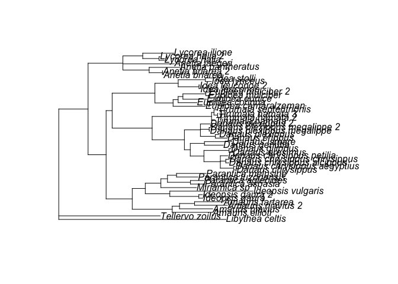
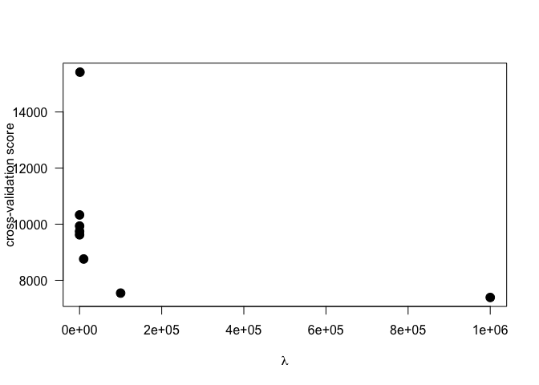
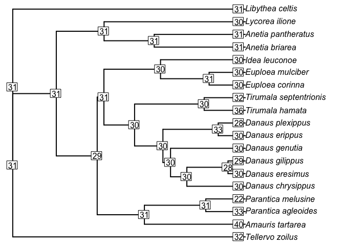

# *Danaus plexippus* haplotype and Danainae phylogenetics
Chris Hamm  
`r format(Sys.Date())`  


Set the seed and load the required packages, then save the version of the packages

```r
set.seed(89623578)
library("phytools")
```

```
## Loading required package: ape
```

```
## Loading required package: maps
```

```r
library("geiger")
library("phytools")

(sess <- sessionInfo())
```

```
## R version 3.3.2 (2016-10-31)
## Platform: x86_64-apple-darwin13.4.0 (64-bit)
## Running under: OS X El Capitan 10.11.6
## 
## locale:
## [1] en_US.UTF-8/en_US.UTF-8/en_US.UTF-8/C/en_US.UTF-8/en_US.UTF-8
## 
## attached base packages:
## [1] stats     graphics  grDevices utils     datasets  methods   base     
## 
## other attached packages:
## [1] geiger_2.0.6    phytools_0.5-64 maps_3.1.1      ape_4.0        
## 
## loaded via a namespace (and not attached):
##  [1] igraph_1.0.1            Rcpp_0.12.9            
##  [3] knitr_1.15.1            magrittr_1.5           
##  [5] splines_3.3.2           MASS_7.3-45            
##  [7] scatterplot3d_0.3-38    mnormt_1.5-5           
##  [9] lattice_0.20-34         quadprog_1.5-5         
## [11] subplex_1.2-2           fastmatch_1.1-0        
## [13] stringr_1.1.0           tools_3.3.2            
## [15] parallel_3.3.2          grid_3.3.2             
## [17] nlme_3.1-130            msm_1.6.4              
## [19] phangorn_2.1.1          clusterGeneration_1.3.4
## [21] plotrix_3.6-4           coda_0.19-1            
## [23] htmltools_0.3.5         yaml_2.1.14            
## [25] survival_2.40-1         rprojroot_1.2          
## [27] digest_0.6.12           numDeriv_2016.8-1      
## [29] Matrix_1.2-8            deSolve_1.14           
## [31] evaluate_0.10           animation_2.4          
## [33] rmarkdown_1.3           stringi_1.1.2          
## [35] backports_1.0.5         combinat_0.0-8         
## [37] expm_0.999-1            mvtnorm_1.0-5
```

Load the phylogeny created by MrBayes:

```r
Dan <- read.nexus("Data/Bayes/Danaini_cat.nex.con.tre")
plot(Dan) # Take a look at the tree
```



```r
is.rooted(Dan) # This is unrooted, we'll need to correct that.
```

```
## [1] FALSE
```

```r
is.ultrametric(Dan) # Will need to make ultrametric as well
```

```
## [1] FALSE
```
Please note, the code to run MrBayes (and the output) is located in the GitHub repo along with the code and output from `chromEvol`.


We'll use the penalized method to make the tree ultrametric

```r
lam <- 10^(-1:6)
cv <- sapply(lam, function(x) sum(attr(chronopl(Dan , lambda = x, CV = TRUE), "D2")))
```

```
## Doing cross-validation
## 
  dropping tip 1 / 48
  dropping tip 2 / 48
  dropping tip 3 / 48
  dropping tip 4 / 48
  dropping tip 5 / 48
  dropping tip 6 / 48
  dropping tip 7 / 48
  dropping tip 8 / 48
  dropping tip 9 / 48
  dropping tip 10 / 48
  dropping tip 11 / 48
  dropping tip 12 / 48
  dropping tip 13 / 48
  dropping tip 14 / 48
  dropping tip 15 / 48
  dropping tip 16 / 48
  dropping tip 17 / 48
  dropping tip 18 / 48
  dropping tip 19 / 48
  dropping tip 20 / 48
  dropping tip 21 / 48
  dropping tip 22 / 48
  dropping tip 23 / 48
  dropping tip 24 / 48
  dropping tip 25 / 48
  dropping tip 26 / 48
  dropping tip 27 / 48
  dropping tip 28 / 48
  dropping tip 29 / 48
  dropping tip 30 / 48
  dropping tip 31 / 48
  dropping tip 32 / 48
  dropping tip 33 / 48
  dropping tip 34 / 48
  dropping tip 35 / 48
  dropping tip 36 / 48
  dropping tip 37 / 48
  dropping tip 38 / 48
  dropping tip 39 / 48
  dropping tip 40 / 48
  dropping tip 41 / 48
  dropping tip 42 / 48
  dropping tip 43 / 48
  dropping tip 44 / 48
  dropping tip 45 / 48
  dropping tip 46 / 48
  dropping tip 47 / 48
  dropping tip 48 / 48
## Doing cross-validation
## 
  dropping tip 1 / 48
  dropping tip 2 / 48
  dropping tip 3 / 48
  dropping tip 4 / 48
  dropping tip 5 / 48
  dropping tip 6 / 48
  dropping tip 7 / 48
  dropping tip 8 / 48
  dropping tip 9 / 48
  dropping tip 10 / 48
  dropping tip 11 / 48
  dropping tip 12 / 48
  dropping tip 13 / 48
  dropping tip 14 / 48
  dropping tip 15 / 48
  dropping tip 16 / 48
  dropping tip 17 / 48
  dropping tip 18 / 48
  dropping tip 19 / 48
  dropping tip 20 / 48
  dropping tip 21 / 48
  dropping tip 22 / 48
  dropping tip 23 / 48
  dropping tip 24 / 48
  dropping tip 25 / 48
  dropping tip 26 / 48
  dropping tip 27 / 48
  dropping tip 28 / 48
  dropping tip 29 / 48
  dropping tip 30 / 48
  dropping tip 31 / 48
  dropping tip 32 / 48
  dropping tip 33 / 48
  dropping tip 34 / 48
  dropping tip 35 / 48
  dropping tip 36 / 48
  dropping tip 37 / 48
  dropping tip 38 / 48
  dropping tip 39 / 48
  dropping tip 40 / 48
  dropping tip 41 / 48
  dropping tip 42 / 48
  dropping tip 43 / 48
  dropping tip 44 / 48
  dropping tip 45 / 48
  dropping tip 46 / 48
  dropping tip 47 / 48
  dropping tip 48 / 48
## Doing cross-validation
## 
  dropping tip 1 / 48
  dropping tip 2 / 48
  dropping tip 3 / 48
  dropping tip 4 / 48
  dropping tip 5 / 48
  dropping tip 6 / 48
  dropping tip 7 / 48
  dropping tip 8 / 48
  dropping tip 9 / 48
  dropping tip 10 / 48
  dropping tip 11 / 48
  dropping tip 12 / 48
  dropping tip 13 / 48
  dropping tip 14 / 48
  dropping tip 15 / 48
  dropping tip 16 / 48
  dropping tip 17 / 48
  dropping tip 18 / 48
  dropping tip 19 / 48
  dropping tip 20 / 48
  dropping tip 21 / 48
  dropping tip 22 / 48
  dropping tip 23 / 48
  dropping tip 24 / 48
  dropping tip 25 / 48
  dropping tip 26 / 48
  dropping tip 27 / 48
  dropping tip 28 / 48
  dropping tip 29 / 48
  dropping tip 30 / 48
  dropping tip 31 / 48
  dropping tip 32 / 48
  dropping tip 33 / 48
  dropping tip 34 / 48
  dropping tip 35 / 48
  dropping tip 36 / 48
  dropping tip 37 / 48
  dropping tip 38 / 48
  dropping tip 39 / 48
  dropping tip 40 / 48
  dropping tip 41 / 48
  dropping tip 42 / 48
  dropping tip 43 / 48
  dropping tip 44 / 48
  dropping tip 45 / 48
  dropping tip 46 / 48
  dropping tip 47 / 48
  dropping tip 48 / 48
## Doing cross-validation
## 
  dropping tip 1 / 48
  dropping tip 2 / 48
  dropping tip 3 / 48
  dropping tip 4 / 48
  dropping tip 5 / 48
  dropping tip 6 / 48
  dropping tip 7 / 48
  dropping tip 8 / 48
  dropping tip 9 / 48
  dropping tip 10 / 48
  dropping tip 11 / 48
  dropping tip 12 / 48
  dropping tip 13 / 48
  dropping tip 14 / 48
  dropping tip 15 / 48
  dropping tip 16 / 48
  dropping tip 17 / 48
  dropping tip 18 / 48
  dropping tip 19 / 48
  dropping tip 20 / 48
  dropping tip 21 / 48
  dropping tip 22 / 48
  dropping tip 23 / 48
  dropping tip 24 / 48
  dropping tip 25 / 48
  dropping tip 26 / 48
  dropping tip 27 / 48
  dropping tip 28 / 48
  dropping tip 29 / 48
  dropping tip 30 / 48
  dropping tip 31 / 48
  dropping tip 32 / 48
  dropping tip 33 / 48
  dropping tip 34 / 48
  dropping tip 35 / 48
  dropping tip 36 / 48
  dropping tip 37 / 48
  dropping tip 38 / 48
  dropping tip 39 / 48
  dropping tip 40 / 48
  dropping tip 41 / 48
  dropping tip 42 / 48
  dropping tip 43 / 48
  dropping tip 44 / 48
  dropping tip 45 / 48
  dropping tip 46 / 48
  dropping tip 47 / 48
  dropping tip 48 / 48
## Doing cross-validation
## 
  dropping tip 1 / 48
  dropping tip 2 / 48
  dropping tip 3 / 48
  dropping tip 4 / 48
  dropping tip 5 / 48
  dropping tip 6 / 48
  dropping tip 7 / 48
  dropping tip 8 / 48
  dropping tip 9 / 48
  dropping tip 10 / 48
  dropping tip 11 / 48
  dropping tip 12 / 48
  dropping tip 13 / 48
  dropping tip 14 / 48
  dropping tip 15 / 48
  dropping tip 16 / 48
  dropping tip 17 / 48
  dropping tip 18 / 48
  dropping tip 19 / 48
  dropping tip 20 / 48
  dropping tip 21 / 48
  dropping tip 22 / 48
  dropping tip 23 / 48
  dropping tip 24 / 48
  dropping tip 25 / 48
  dropping tip 26 / 48
  dropping tip 27 / 48
  dropping tip 28 / 48
  dropping tip 29 / 48
  dropping tip 30 / 48
  dropping tip 31 / 48
  dropping tip 32 / 48
  dropping tip 33 / 48
  dropping tip 34 / 48
  dropping tip 35 / 48
  dropping tip 36 / 48
  dropping tip 37 / 48
  dropping tip 38 / 48
  dropping tip 39 / 48
  dropping tip 40 / 48
  dropping tip 41 / 48
  dropping tip 42 / 48
  dropping tip 43 / 48
  dropping tip 44 / 48
  dropping tip 45 / 48
  dropping tip 46 / 48
  dropping tip 47 / 48
  dropping tip 48 / 48
## Doing cross-validation
## 
  dropping tip 1 / 48
  dropping tip 2 / 48
  dropping tip 3 / 48
  dropping tip 4 / 48
  dropping tip 5 / 48
  dropping tip 6 / 48
  dropping tip 7 / 48
  dropping tip 8 / 48
  dropping tip 9 / 48
  dropping tip 10 / 48
  dropping tip 11 / 48
  dropping tip 12 / 48
  dropping tip 13 / 48
  dropping tip 14 / 48
  dropping tip 15 / 48
  dropping tip 16 / 48
  dropping tip 17 / 48
  dropping tip 18 / 48
  dropping tip 19 / 48
  dropping tip 20 / 48
  dropping tip 21 / 48
  dropping tip 22 / 48
  dropping tip 23 / 48
  dropping tip 24 / 48
  dropping tip 25 / 48
  dropping tip 26 / 48
  dropping tip 27 / 48
  dropping tip 28 / 48
  dropping tip 29 / 48
  dropping tip 30 / 48
  dropping tip 31 / 48
  dropping tip 32 / 48
  dropping tip 33 / 48
  dropping tip 34 / 48
  dropping tip 35 / 48
  dropping tip 36 / 48
  dropping tip 37 / 48
  dropping tip 38 / 48
  dropping tip 39 / 48
  dropping tip 40 / 48
  dropping tip 41 / 48
  dropping tip 42 / 48
  dropping tip 43 / 48
  dropping tip 44 / 48
  dropping tip 45 / 48
  dropping tip 46 / 48
  dropping tip 47 / 48
  dropping tip 48 / 48
## Doing cross-validation
## 
  dropping tip 1 / 48
  dropping tip 2 / 48
  dropping tip 3 / 48
  dropping tip 4 / 48
  dropping tip 5 / 48
  dropping tip 6 / 48
  dropping tip 7 / 48
  dropping tip 8 / 48
  dropping tip 9 / 48
  dropping tip 10 / 48
  dropping tip 11 / 48
  dropping tip 12 / 48
  dropping tip 13 / 48
  dropping tip 14 / 48
  dropping tip 15 / 48
  dropping tip 16 / 48
  dropping tip 17 / 48
  dropping tip 18 / 48
  dropping tip 19 / 48
  dropping tip 20 / 48
  dropping tip 21 / 48
  dropping tip 22 / 48
  dropping tip 23 / 48
  dropping tip 24 / 48
  dropping tip 25 / 48
  dropping tip 26 / 48
  dropping tip 27 / 48
  dropping tip 28 / 48
  dropping tip 29 / 48
  dropping tip 30 / 48
  dropping tip 31 / 48
  dropping tip 32 / 48
  dropping tip 33 / 48
  dropping tip 34 / 48
  dropping tip 35 / 48
  dropping tip 36 / 48
  dropping tip 37 / 48
  dropping tip 38 / 48
  dropping tip 39 / 48
  dropping tip 40 / 48
  dropping tip 41 / 48
  dropping tip 42 / 48
  dropping tip 43 / 48
  dropping tip 44 / 48
  dropping tip 45 / 48
  dropping tip 46 / 48
  dropping tip 47 / 48
  dropping tip 48 / 48
## Doing cross-validation
## 
  dropping tip 1 / 48
  dropping tip 2 / 48
  dropping tip 3 / 48
  dropping tip 4 / 48
  dropping tip 5 / 48
  dropping tip 6 / 48
  dropping tip 7 / 48
  dropping tip 8 / 48
  dropping tip 9 / 48
  dropping tip 10 / 48
  dropping tip 11 / 48
  dropping tip 12 / 48
  dropping tip 13 / 48
  dropping tip 14 / 48
  dropping tip 15 / 48
  dropping tip 16 / 48
  dropping tip 17 / 48
  dropping tip 18 / 48
  dropping tip 19 / 48
  dropping tip 20 / 48
  dropping tip 21 / 48
  dropping tip 22 / 48
  dropping tip 23 / 48
  dropping tip 24 / 48
  dropping tip 25 / 48
  dropping tip 26 / 48
  dropping tip 27 / 48
  dropping tip 28 / 48
  dropping tip 29 / 48
  dropping tip 30 / 48
  dropping tip 31 / 48
  dropping tip 32 / 48
  dropping tip 33 / 48
  dropping tip 34 / 48
  dropping tip 35 / 48
  dropping tip 36 / 48
  dropping tip 37 / 48
  dropping tip 38 / 48
  dropping tip 39 / 48
  dropping tip 40 / 48
  dropping tip 41 / 48
  dropping tip 42 / 48
  dropping tip 43 / 48
  dropping tip 44 / 48
  dropping tip 45 / 48
  dropping tip 46 / 48
  dropping tip 47 / 48
  dropping tip 48 / 48
```

```r
cv
```

```
## [1] 10330.216  9743.406  9621.645  9934.510 15418.434  8759.622  7544.159
## [8]  7388.974
```

```r
plot(x = lam, y = cv, pch = 19, ylab = "cross-validation score", xlab = expression(paste(lambda)), las = 1, cex = 1.5) # lowest CV is alpha 1e6, suggests that branches each have different rate
```




```r
Dan2 <- chronopl(phy = Dan, lambda = 1e6, CV = TRUE, eval.max = 1e3, iter.max = 1e4)
```

```
## Doing cross-validation
## 
  dropping tip 1 / 48
  dropping tip 2 / 48
  dropping tip 3 / 48
  dropping tip 4 / 48
  dropping tip 5 / 48
  dropping tip 6 / 48
  dropping tip 7 / 48
  dropping tip 8 / 48
  dropping tip 9 / 48
  dropping tip 10 / 48
  dropping tip 11 / 48
  dropping tip 12 / 48
  dropping tip 13 / 48
  dropping tip 14 / 48
  dropping tip 15 / 48
  dropping tip 16 / 48
  dropping tip 17 / 48
  dropping tip 18 / 48
  dropping tip 19 / 48
  dropping tip 20 / 48
  dropping tip 21 / 48
  dropping tip 22 / 48
  dropping tip 23 / 48
  dropping tip 24 / 48
  dropping tip 25 / 48
  dropping tip 26 / 48
  dropping tip 27 / 48
  dropping tip 28 / 48
  dropping tip 29 / 48
  dropping tip 30 / 48
  dropping tip 31 / 48
  dropping tip 32 / 48
  dropping tip 33 / 48
  dropping tip 34 / 48
  dropping tip 35 / 48
  dropping tip 36 / 48
  dropping tip 37 / 48
  dropping tip 38 / 48
  dropping tip 39 / 48
  dropping tip 40 / 48
  dropping tip 41 / 48
  dropping tip 42 / 48
  dropping tip 43 / 48
  dropping tip 44 / 48
  dropping tip 45 / 48
  dropping tip 46 / 48
  dropping tip 47 / 48
  dropping tip 48 / 48
```

```r
is.ultrametric(Dan2)
```

```
## [1] TRUE
```

```r
Dan2 <- root(phy = Dan2, outgroup = 44, resolve.root = TRUE)
is.rooted(Dan2)
```

```
## [1] TRUE
```

Read in the covariate data (the karyotypes from the literature)

```r
Dan_data <- read.csv("Danainae_karyotypes2.csv", header = TRUE, row.names = 1)
str(Dan_data)
```

```
## 'data.frame':	20 obs. of  1 variable:
##  $ n: int  32 40 33 22 30 30 28 30 30 30 ...
```

```r
Dan_data
```

```
##                         n
## Tellervo_zoilus        32
## Amauris_tartarea       40
## Parantica_agleoides    33
## Parantica_melusine     22
## Danaus_genutia         30
## Danaus_cleophile       30
## Danaus_plexippus       28
## Danaus_erippus         30
## Danaus_chrysippus      30
## Danaus_eresimus        30
## Danaus_gilippus        29
## Tirumala_hamata        36
## Tirumala_septentrionis 32
## Euploea_corinna        30
## Euploea_mulciber       30
## Idea_leuconoe          30
## Anetia_briarea         31
## Anetia_pantheratus     31
## Lycorea_ilione         30
## Libythea_celtis        31
```

Now we remove the taxa in the tree but not in the data, and vice versa.

```r
Dan_norm <- treedata(phy = Dan2, data = Dan_data, sort = TRUE, warnings = TRUE)
```

```
## Warning in treedata(phy = Dan2, data = Dan_data, sort = TRUE, warnings = TRUE): The following tips were not found in 'data' and were dropped from 'phy':
## 	Amauris_ellioti
## 	Amauris_niavius
## 	Amauris_niavius_2
## 	Anetia_briarea_2
## 	Anetia_jaegeri
## 	Danaus_chrysippus_aegyptius
## 	Danaus_chrysippus_alcippus
## 	Danaus_chrysippus_chrysippus
## 	Danaus_chrysippus_petilia
## 	Danaus_ismare
## 	Danaus_plexippus_2
## 	Danaus_plexippus_megalippe
## 	Danaus_plexippus_megalippe_2
## 	Euploea_camaralzeman
## 	Euploea_eunice
## 	Euploea_mulciber_2
## 	Idea_leuconoe_2
## 	Idea_lynceus
## 	Idea_stolli
## 	Ideopsis_gaura
## 	Ideopsis_gaura_2
## 	Ideopsis_vulgaris
## 	Lycorea_halia
## 	Lycorea_halia_2
## 	Miriamica_sp
## 	Parantica_aspasia
## 	Parantica_luzonensis
## 	Tirumala_hamata_2
## 	Tirumala_hamata_3
```

```
## Warning in treedata(phy = Dan2, data = Dan_data, sort = TRUE, warnings = TRUE): The following tips were not found in 'phy' and were dropped from 'data':
## 	Danaus_cleophile
```

```r
# Now need to sort the data to make sure they are in the same order as the tip labels.
Covs <- Dan_norm$data[Dan_norm$phy$tip.label,, drop = FALSE]
```

Here is figure 1 from the pre-print

```r
Covs2 <- as.matrix(Covs)[, 1]
seq1 <- seq(from = 20, to = 36)
ancs <- c(31, 31, 31, 29, 31, 31, 31, 30, 30, 30, 30, 28, 33, 30, 30, 31, 31)
sa <- cbind(seq1, ancs)

plot.phylo(Dan_norm$phy, align.tip.label = TRUE, type = "phylogram", use.edge.length = TRUE, edge.width = 2, root.edge = TRUE, no.margin = TRUE, adj = 0)
# tiplabels(text = Covs2, adj = -9.3, frame = "none", bg = "white")
tiplabels(text = Covs2, adj = 1.2, frame = "rect", bg = "white")
nodelabels(text = sa[, 2], frame = "rect", bg = "white")
```

```
## Warning in XX - width * adj[1]: longer object length is not a multiple of
## shorter object length
```

```
## Warning in xl + width: longer object length is not a multiple of shorter
## object length
```

```
## Warning in YY - height * adj[2]: longer object length is not a multiple of
## shorter object length
```

```
## Warning in yb + height: longer object length is not a multiple of shorter
## object length
```


